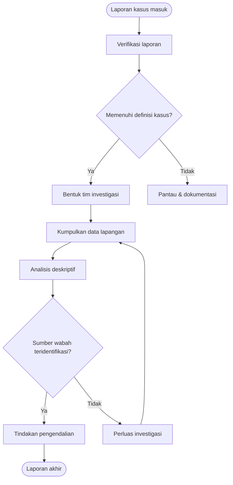
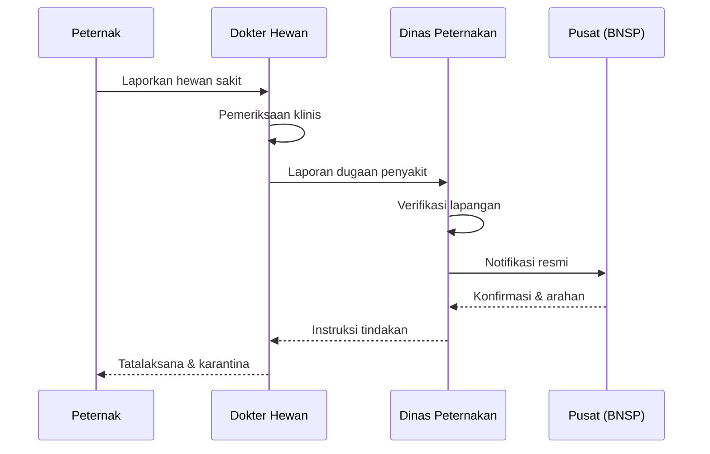
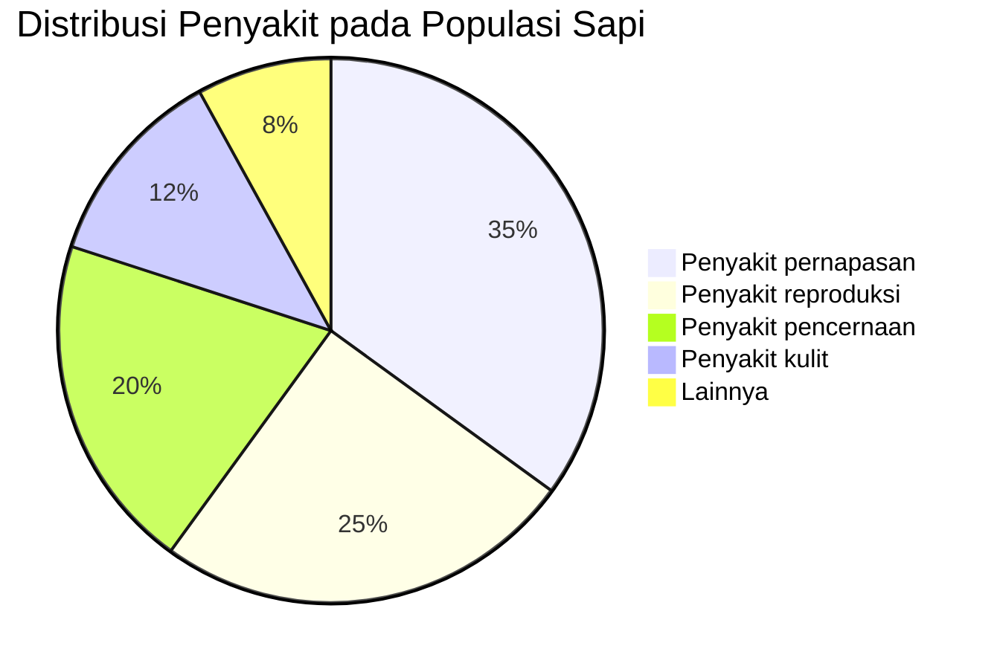
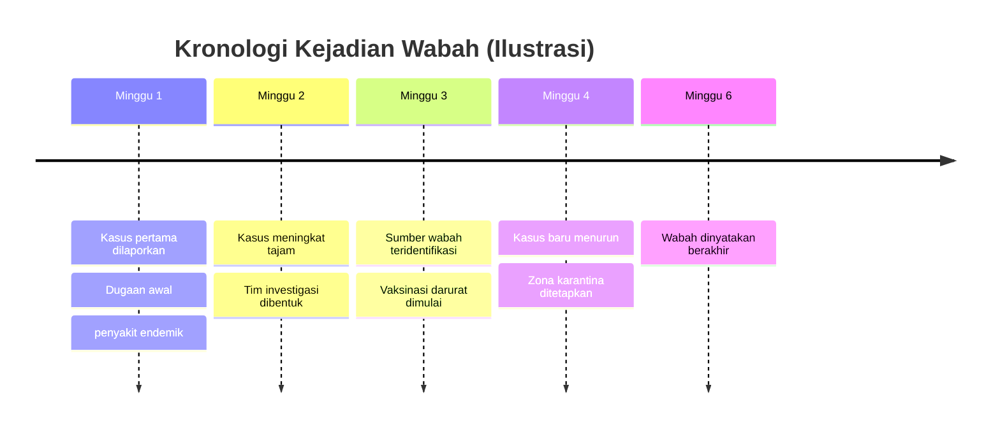

## A. Diagram Batang

  <canvas class="js-chart"
    data-type="bar"
    data-label="Jumlah Kasus"
    data-labels='["Jan", "Feb", "Mar", "Apr", "Mei", "Jun"]'
    data-values='[12, 19, 8, 15, 22, 10]'>
  </canvas>
  
Diagram 1. Jumlah kasus penyakit per bulan (ilustrasi).

## B. Diagram Garis

  <canvas class="js-chart"
    data-type="line"
    data-label="Prevalensi (%)"
    data-labels='["2018", "2019", "2020", "2021", "2022", "2023"]'
    data-values='[3.2, 4.1, 6.8, 5.5, 4.9, 3.7]'>
  </canvas>
  
Diagram 2. Tren prevalensi penyakit selama enam tahun (ilustrasi).

## C. Diagram Diagram Alir

Diagram alir **tidak bisa** dibuat secara otomatis dari Markdown biasa. Ada dua opsi yang tersedia dalam sistem ini:

1. **Gambar statis** — buat diagram alir di aplikasi lain (misalnya draw.io atau Canva), ekspor sebagai gambar, lalu sisipkan ke modul.
2. **HTML manual** — diagram alir sederhana bisa dibuat dengan HTML dan CSS secara langsung di dalam file `.md`, seperti contoh berikut.

  
Mulai

  

  
Identifikasi kasus

  

  
Apakah memenuhi definisi kasus?

  

    

      

      
Ya

      
Laporkan ke dinas

    

    

      

      
Tidak

      
Pemantauan lanjut

    

  

Diagram 3. Alur sederhana identifikasi kasus (ilustrasi).

## D. Rumus Matematika

Rumus dapat ditulis secara *inline* maupun *display*. Berikut beberapa contoh.

### I. Rumus inline

Incidence rate dihitung dengan rumus $IR = \frac{D}{PT}$, di mana $D$ adalah jumlah kasus baru dan $PT$ adalah person-time at risk.

### II. Rumus display

**Rumus prevalensi:**

$$P = \frac{\text{Jumlah kasus aktif}}{\text{Jumlah populasi berisiko}} \times 100\%$$

**Rumus ukuran sampel:**

$$n = \frac{Z^2 \times p \times (1-p)}{d^2}$$

**Rumus odds ratio:**

$$OR = \frac{a \times d}{b \times c}$$

## E. Tabel

| Parameter | Rumus | Satuan |
|-----------|-------|--------|
| Incidence Rate | $\frac{D}{PT}$ | Kasus per hewan-tahun |
| Prevalensi | $\frac{D}{N} \times 100$ | % |
| Case Fatality Rate | $\frac{\text{Kematian}}{\text{Kasus}} \times 100$ | % |
| Attack Rate | $\frac{\text{Kasus baru}}{\text{Populasi awal}} \times 100$ | % |

## F. Callout

  <i data-lucide="info" class="w-5 h-5"></i>
  
Callout digunakan untuk menyoroti informasi penting yang perlu diperhatikan pembaca. Gunakan elemen ini dengan hemat agar tidak kehilangan efeknya.

  <i data-lucide="triangle-alert" class="w-5 h-5" style="color: #f59e0b;"></i>
  
Callout peringatan bisa dibuat dengan mengubah warna secara manual melalui atribut <code>style</code>.

## G. Tombol Simulasi

  <a href="#" class="btn-action shadow-md">
    Buka Simulasi
    <i data-lucide="chevron-right" class="w-4 h-4"></i>
  </a>

## H. Kuis

  <h4 class="text-lg font-semibold mb-2">Pertanyaan Uji</h4>
  
Manakah yang merupakan ukuran frekuensi penyakit yang paling tepat untuk penyakit kronis dengan durasi panjang?

  

    <label class="flex items-start gap-3 p-4 rounded-xl border border-slate-200 dark:border-slate-800 hover:bg-slate-50 dark:hover:bg-slate-800 transition cursor-pointer">
      <input type="radio" name="q1" value="a" class="mt-1.5 accent-brand">
      Incidence rate
    </label>
    <label class="flex items-start gap-3 p-4 rounded-xl border border-slate-200 dark:border-slate-800 hover:bg-slate-50 dark:hover:bg-slate-800 transition cursor-pointer">
      <input type="radio" name="q1" value="b" data-correct class="mt-1.5 accent-brand">
      Prevalensi
    </label>
    <label class="flex items-start gap-3 p-4 rounded-xl border border-slate-200 dark:border-slate-800 hover:bg-slate-50 dark:hover:bg-slate-800 transition cursor-pointer">
      <input type="radio" name="q1" value="c" class="mt-1.5 accent-brand">
      Attack rate
    </label>
    <label class="flex items-start gap-3 p-4 rounded-xl border border-slate-200 dark:border-slate-800 hover:bg-slate-50 dark:hover:bg-slate-800 transition cursor-pointer">
      <input type="radio" name="q1" value="d" class="mt-1.5 accent-brand">
      Case fatality rate
    </label>
  

  

    <button data-check class="bg-brand hover:bg-indigo-700 text-white transition font-medium">Periksa Jawaban</button>
    <button data-reset class="text-slate-500 hover:text-slate-700 dark:hover:text-slate-300 text-sm font-medium">Reset</button>
  

  

## I. Gambar dengan Keterangan

<figure>
  
  <figcaption>Gambar 1. Ilustrasi analisis data dalam kajian epidemiologi veteriner.</figcaption>
</figure>

## J. Blockquote

> Epidemiologi adalah ilmu dasar kesehatan masyarakat. Tanpanya, kita tidak bisa membedakan mana yang kebetulan dan mana yang merupakan pola yang bermakna.

## K. Daftar Bertingkat

Berikut contoh daftar bertingkat yang mendukung hingga empat level:

1. Pendekatan epidemiologi
   1. Deskriptif
      1. Studi kasus
      2. Studi ekologi
   2. Analitis
      1. Observasional
         1. Kohort
         2. Kasus-kontrol
         3. Potong lintang
      2. Eksperimental
2. Ukuran epidemiologi
   - Frekuensi
   - Asosiasi
   - Dampak

## L. Mermaid.js

## M. Tabel kontingensi 2×2

Tabel 1. Tabel kontingensi 2×2 hubungan antara paparan dan kejadian penyakit.

  

    <table class="w-full text-left">
      <thead class="bg-slate-50 dark:bg-slate-800/50 border-b border-slate-200 dark:border-slate-800">
        <tr>
          <th class="py-4 px-6 font-semibold text-slate-900 dark:text-white" rowspan="2">Paparan</th>
          <th class="py-4 px-6 font-semibold text-slate-900 dark:text-white text-center" colspan="2">Status Penyakit</th>
          <th class="py-4 px-6 font-semibold text-slate-900 dark:text-white text-center" rowspan="2">Total</th>
        </tr>
        <tr class="border-t border-slate-200 dark:border-slate-800">
          <th class="py-3 px-6 font-semibold text-slate-900 dark:text-white text-center">Sakit (<em>a+c</em>)</th>
          <th class="py-3 px-6 font-semibold text-slate-900 dark:text-white text-center">Tidak Sakit (<em>b+d</em>)</th>
        </tr>
      </thead>
      <tbody class="divide-y divide-slate-100 dark:divide-slate-800">
        <tr>
          <td class="py-4 px-6 font-medium">Terpapar (<em>a+b</em>)</td>
          <td class="py-4 px-6 text-center font-mono">a</td>
          <td class="py-4 px-6 text-center font-mono">b</td>
          <td class="py-4 px-6 text-center font-mono">a+b</td>
        </tr>
        <tr>
          <td class="py-4 px-6 font-medium">Tidak Terpapar (<em>c+d</em>)</td>
          <td class="py-4 px-6 text-center font-mono">c</td>
          <td class="py-4 px-6 text-center font-mono">d</td>
          <td class="py-4 px-6 text-center font-mono">c+d</td>
        </tr>
        <tr class="bg-slate-50 dark:bg-slate-800/30">
          <td class="py-4 px-6 font-semibold">Total</td>
          <td class="py-4 px-6 text-center font-mono font-semibold">a+c</td>
          <td class="py-4 px-6 text-center font-mono font-semibold">b+d</td>
          <td class="py-4 px-6 text-center font-mono font-semibold">N</td>
        </tr>
      </tbody>
    </table>
  

